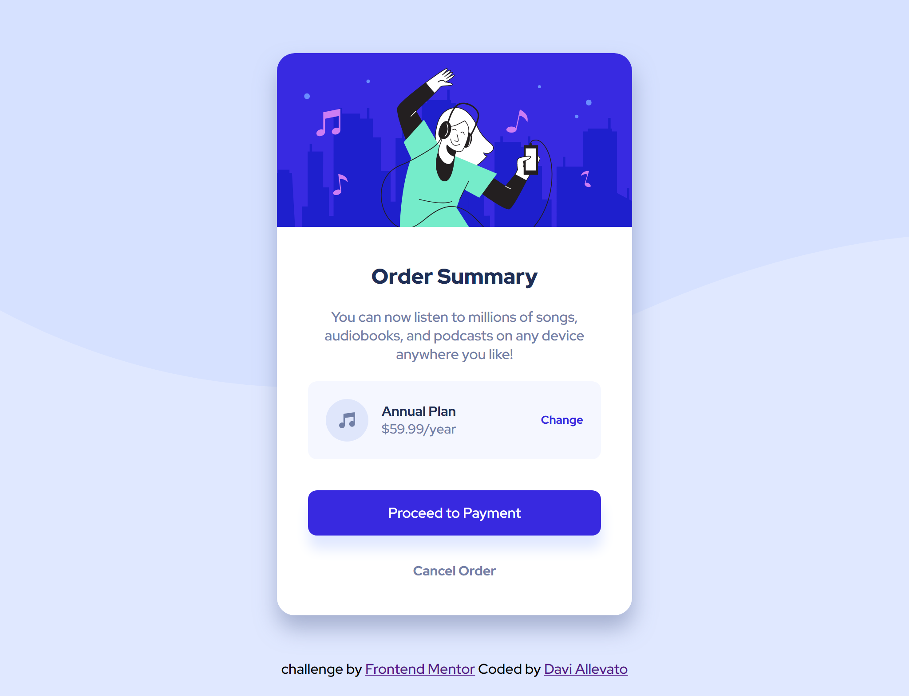

# Frontend Mentor - Order summary component

Esta é uma solução para o [Order summary component](https://www.frontendmentor.io/challenges/order-summary-component-QlPmajDUj). Os desafios do Frontend Mentor ajudam você a melhorar suas habilidades de codificação criando projetos realistas.

## Índice

- [Visão geral](#visão-geral)
  - [O desafio](#O-desafio)
  - [Screenshot](#Screenshot)
  - [Links](#links)
- [Meu processo](#Meu-processo)
  - [Construído com](#Construído-com)
  - [O que aprendi](#O-que-aprendi)
  - [Recursos úteis](#Recursos-úteis)
- [Autor](#autor)


## Visão geral

### O desafio

Os usuários devem ser capazes de:

- Visualize o layout ideal dependendo do tamanho da tela do dispositivo
- Veja os estados de foco para elementos interativos

### Screenshot




### Links

- URL da solução: [https://www.frontendmentor.io/solutions/order-summary-responsivo-utilizando-html-e-css-_LLGP3BAB](https://www.frontendmentor.io/solutions/order-summary-responsivo-utilizando-html-e-css-_LLGP3BAB)

- URL do site ao vivo: [https://daviallevato.github.io/FM-Order-summary-component/](https://daviallevato.github.io/FM-Order-summary-component/)

## Meu processo

### Construído com

- Semantic HTML5 markup
- CSS custom properties
- Flexbox

### O que eu aprendi

Aprendi o uso de um recurso novo:

```css

.imagem{
    display: contents;
}
.imagem img{
    width: 100%;
    border-top-left-radius: 20px;
    border-top-right-radius: 20px;
}

```

Quando a propriedade **display** é definida como **contents**, significa que as características da caixa delimitadora do espaço do elemento serão ignoradas e ele fará parte do elemento pai. Vale ressaltar que outras propriedades definidas para o elemento continuam valendo, como a cor e o estilo da fonte.


### Recursos úteis

- [Stack Overflow](https://pt.stackoverflow.com/questions/352318/para-que-serve-e-como-usar-o-display-contents-do-css) - Esse é um site de perguntas e respostas que me ajudou no entendimento do **display: content;**.

- [Blog.betrybe](https://blog.betrybe.com/css/css-display/) - Este é um artigo que me ajudou a entender **display**. Eu recomendo para quem ainda está aprendendo este conceito.

## Autor

- Frontend Mentor - [@DaviAllevato](https://www.frontendmentor.io/profile/DaviAllevato)

- GitHub - [@DaviAllevato](https://github.com/DaviAllevato)


